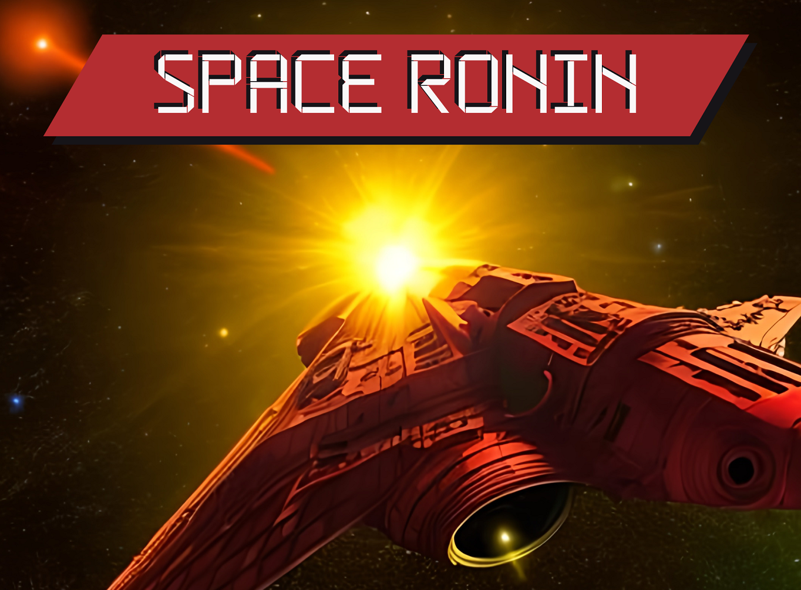
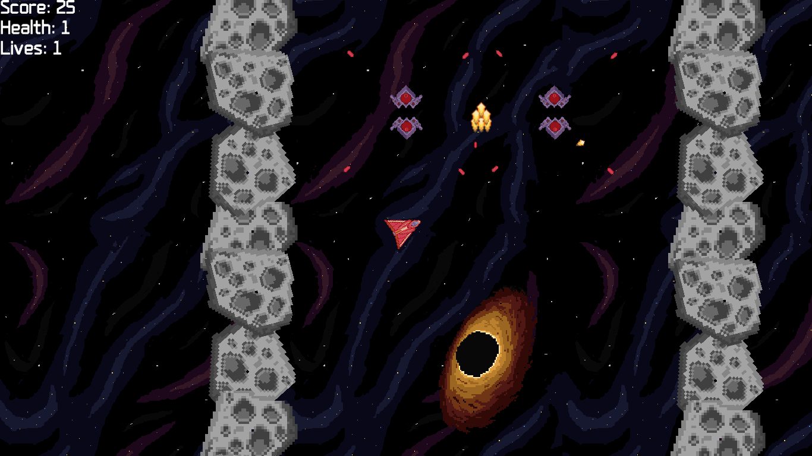
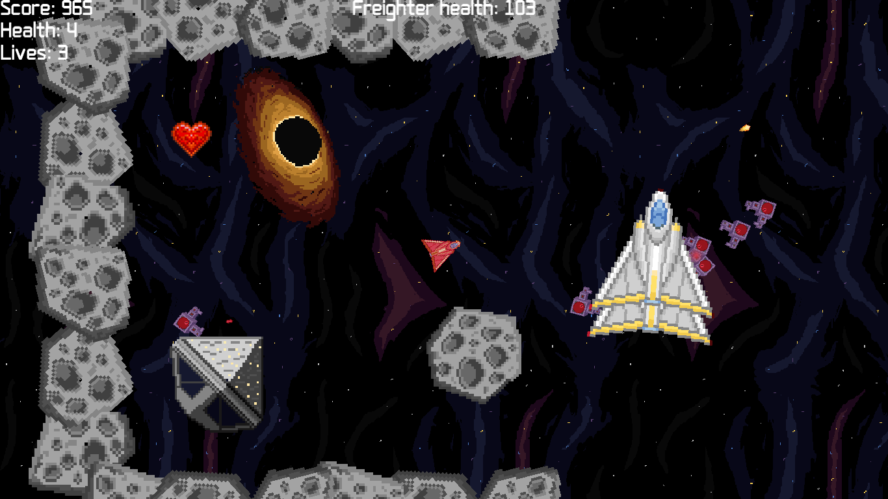
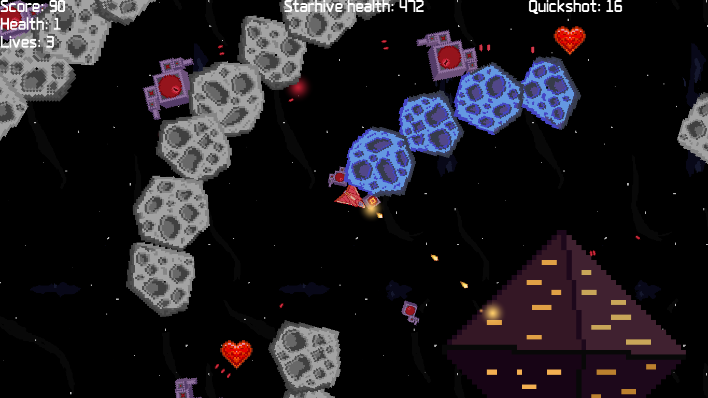

# **Space Ronin**

"Space Ronin" is a classic 2D space shooter with a backstory and fun game mechanics. You can watch a [video showcase](https://www.youtube.com/watch?v=8sJFVolDWoY) of the project or play it yourself [here](https://wgrodzicki.itch.io/space-ronin).

## **Technologies used**

The game was made in the Unity engine using C# scripting.

## **Features**

#### Backstory

You are a space ronin - a space mercenary - hired to get rid of galactic pirates. You do your job as good as you can, but not everything will go according to your plans...

#### Levels

During the game you progress through 3 differently designed levels. At the beginning of each level I included an introduction that informs you about the challenges you will face and the specific goal to accomplish in order to win.

#### Unique mechanics

There are several unique game mechanics you will encounter, such as:

- black holes dragging you (and your enemies) in
- destroyable environment elements
- objects that need protection from the enemies

#### Power-ups

There are 2 types of power-ups that help to get through the levels more easily:

- health restoration power-up
- shooting enhancer power-up

## **How to play?**

Start a new game to progress through all the levels or choose the specific level you want. Use mouse and arrow keys to navigate your spaceship, click left mouse button to shoot.

## **Main challenges**

When designing and implementing the project I stumbled upon several challenges:

- _C# scripting_. This was my first serious Unity project, so I had to get accustomed to the specifics of C# scripting within the Unity framework and how the code derived from the MonoBehaviour class works.

- _Player respawn_. I decided to introduce a short waiting period between player's death animation and respawn. The solution was to implement a counter in the Update() method, so that it was incremented with each frame, using the Time.deltaTime property.

- _Black holes mechanics_. I wanted the black holes to attract the player and the enemies, but in a way that leaves an opportunity to escape. First I tried to code it "by hand", but fortunately I discovered very useful methods of the Vector2 class, namely Distance() and MoveTowards(). They made the task much easier.

## **Credits**

Created by Wojciech Grodzicki.

- Starting assets and scripts by the [Michigan State University](https://www.coursera.org/learn/game-design-and-development-1)
- Health buff asset by [shinzohotoroki](https://opengameart.org/users/shinzohotoroki) via [OpenGameArt](https://opengameart.org/content/heart-3)
- Font by Ethan Park via [CreativeAlys](https://www.creativealys.com/2015/09/01/aperture-digital-typeface/)
- Cover & icon created using AI from [OpenArt](https://openart.ai/)

The game was made as the final project for the Michigan State University's course "Game Design and Development 1".
